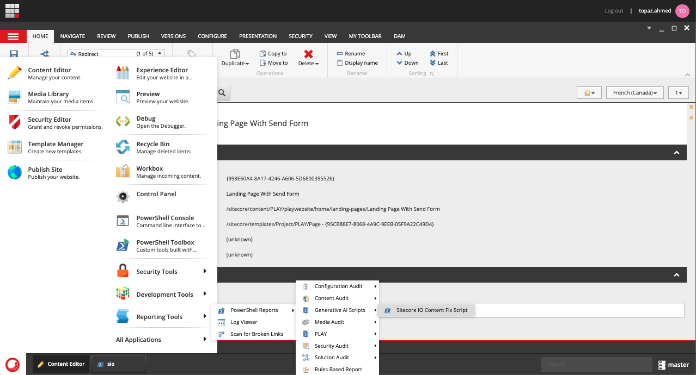
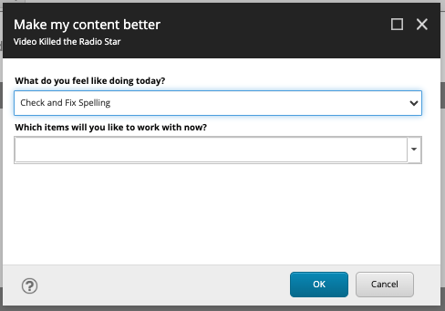

# Sitecore Hackathon 2024

# Hackathon Submission Entry form

## Team name
SITECORE.IO

## Category
AI Integration with XP or XM Cloud

## Description

### Purpose
Generative AI: The New Powerhouse
Harnessing the capabilities of generative AI feels akin to witnessing a modern marvel. It's omnipresent, wielding the ability to resurrect text, conjure images, and perform feats that seem almost miraculous.

In light of recent events, I've delved deeper into AI to highlight its prowess. Picture this: Your organization opts to replace high-paid Sitecore developers in North America with more cost-effective counterparts abroad. However, language discrepancies arise, with content riddled with errors due to non-native English speakers.

Purchasing language processing plugins is an option, but it comes with a price tag. Our focus is on efficiency and cost-effectiveness. Hence, I've developed a script capable of rectifying grammar, spelling, and even restructuring content to fit desired tones, be it formal, casual, or even pirate-like.

Furthermore, in today's globalized landscape, conducting business solely in English is outdated. Hence, the tool also facilitates translation, offering substantial cost savings by allowing you to engage developers in Canada or other locales. Imagine the convenience: a button in the ribbon, a single click, and voila! Content is corrected, formatted, and translated seamlessly. With some finesse, this dream could be a reality at your fingertips.

## Video link

⟹ [Video link](https://youtu.be/EtzRVCzC_IQ)

## Pre-requisites and Dependencies

- a Keyboard, mouse, a Sitecore instance
- Sitecore Powershell Extensions

## Installation instructions
1. Use the Sitecore Installation wizard to install the [package](https://github.com/Sitecore-Hackathon/2024-Sitecore-io/blob/main/Packages/SITECORE%20io%20Scripts-1.1.zip)
2. Go to PowerShell reports and run it. 

3. Select what you want to do, and which item you want to start with. 

3. profit

### Configuration
No configuration needed

## Usage instructions
1. this script starts running at the item that is selected. 
2. finds al the Text and Rich Text fields. 
2. works with those values only. 
1. Fixing the spelling and grammer takes the existing text and fixes it then saves it in the field. 
1. Translation task will create a version of the missing Language, thats setup in the instance. Translate the text and save the item. 
1. Rewrite will modify the text to make it sounds more professional. 
1. Image alt text generation and content generation was an idea that could not be implemented due to time constraint. 

## Comments
My windows computer fell into it's demise two week's ago. Since that I have been on my Macbook and has been dreading this Hackathon and how I would participate. But thank for for XM Cloud. I was able to use my existing instance and just work with Powershell ISE to get something going. I am not expecting much out of it but I did have fun telling my wife that I am working with AI.